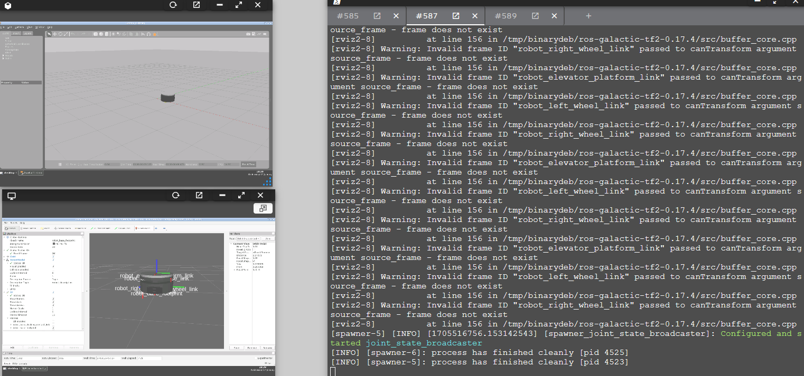
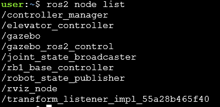
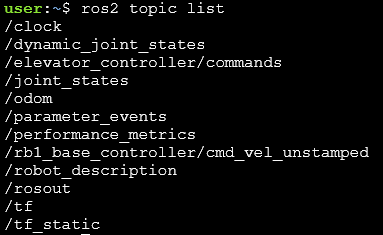
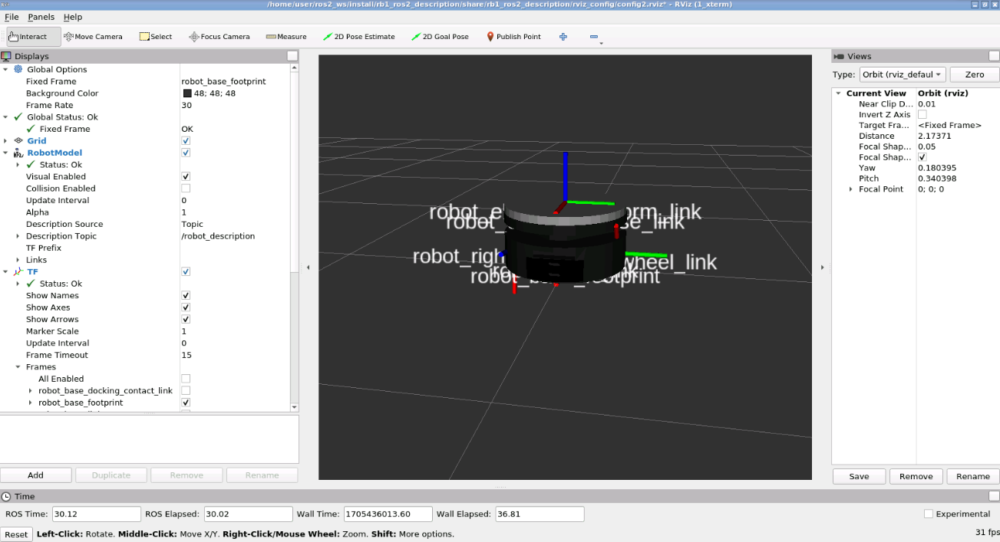

# cp15_ros2_control
The main of this work is to add controllers to the robot RB1 by using ROS2_control. 
You will be able to control RB1 using keyboard and move the lift unit by publishing to a topic.
For installation use: 
```
git clone https://github.com/Andy-Leo10/cp15_ros2_control.git
```
Please follow these guidelines to test:

## 0. Start
+ Launch the ROS2 simulation
```
cd ~/ros2_ws/ ;colcon build;source install/setup.bash
ros2 launch rb1_ros2_description rb1_ros2_xacro.launch.py
```
Keep in mind that Gazebo may not always start up properly on the first try. 
If you encounter an error and Gazebo fails to load, simply kill the process using Ctrl + C and relaunch the file.
If the simulation launches correctly, you should be able to see the RB-1 robot in an empty world and RVIZ, like in the image below:


+ Check the controllers
```
ros2 control list_hardware_interfaces
ros2 control list_controllers
```

+ MANDATORY: Check the nodes and topics and get these



+ MANDATORY: Check RVIZ and see the TF's


## 1. Differential drive
+ Test the drive controller  
```
ros2 topic pub --rate 10 /rb1_base_controller/cmd_vel_unstamped geometry_msgs/msg/Twist "{linear: {x: 0.0, y: 0, z: 0.0}, angular: {x: 0.0,y: 0.0, z: 0.2}}"
ros2 run teleop_twist_keyboard teleop_twist_keyboard --ros-args --remap cmd_vel:=/rb1_base_controller/cmd_vel_unstamped
```

## 2. Lifting unit
+ Test the elevator, moving it up and down
```
ros2 topic pub /elevator_controller/commands std_msgs/msg/Float64MultiArray "data: [0.1]" -1
ros2 topic pub /elevator_controller/commands std_msgs/msg/Float64MultiArray "data: [0.0]" -1
```

## Annexes 
+ useful commands
```
ros2 run tf2_tools view_frames
```
