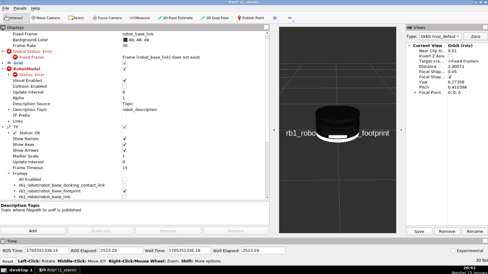

# cp15_ros2_control
Add controllers to the robot RB1 by using ROS2_control



## 0. Start
+ Launch the ROS2 simulation
```
cd ~/ros2_ws/ ;colcon build;source install/setup.bash
ros2 launch rb1_ros2_description rb1_ros2_xacro.launch.py
```

## 1. Differential drive
+ Test the drive controller  
```
ros2 control list_hardware_interfaces
ros2 control list_controllers
ros2 topic pub --rate 10 /rb1_base_controller/cmd_vel_unstamped geometry_msgs/msg/Twist "{linear: {x: 0.0, y: 0, z: 0.0}, angular: {x: 0.0,y: 0.0, z: 0.2}}"
ros2 run teleop_twist_keyboard teleop_twist_keyboard --ros-args --remap cmd_vel:=/rb1_base_controller/cmd_vel_unstamped
```

## 2. Lifting unit
+ Test ...
```
ros2 service call /apply_joint_effort gazebo_msgs/srv/ApplyJointEffort '{joint_name: "lift_joint", effort: -2.0, start_time: {sec: 0, nanosec: 0}, duration: {sec: 2000, nanosec: 0} }'
```

## Annexes 
+ useful commands
```
ros2 run tf2_tools view_frames
```
